# Simple Task Manager

A personal task management web app built on Laravel. Originally a course project for **Antakya Private University's Advanced Web Programming** module (instructors: Abdo Ibrahim Al-Khouri, Kenan Farhani), now being grown into a daily-use product.

Live at **https://tasks-app.duckdns.org** — every push to `main` auto-deploys via GitHub Actions → GHCR → Watchtower (see [Deployment](#deployment) below). `main` is the single source of truth.

The pristine course submission is preserved at tag [`submission-v1`](https://github.com/ibrah5em/simple-task-manager/releases/tag/submission-v1) — `git checkout submission-v1` if you ever need that exact snapshot.

## Features (shipped)

**Core app**
- Email/password auth (Laravel Breeze).
- Full task CRUD with per-user scoping enforced by policies.
- Inline complete-toggle, bulk actions (complete / uncomplete / delete), snooze (tomorrow / next week / pick a date).
- Pagination, search, filters (active / completed / overdue / due this week), sort.
- Categories (many-to-many, per-user) with color chips.
- Priority (low/med/high) with colored badges.
- Profile page (name / email / phone / password).

**Daily-use power**
- **Smart views**: Today, Inbox, Upcoming — surfaced in the sidebar with live count badges.
- **Quick-add modal** (press `c` anywhere): natural-language parser extracts `!high`/`!med`/`!low`, `#category` tags, and date phrases (`tomorrow`, `next mon`, `5pm`, `jul 4`, `in 3 days`, …) from a single text field, with live preview.
- **Recurring tasks** (RRULE / iCal via `simshaun/recurr`) — daily, weekdays, weekly, monthly. New instance auto-generated when the current one is completed; scheduler pre-materializes 7 days ahead.
- **Subtasks / checklists** with drag-to-reorder and a `3/5` progress badge in lists.
- **Markdown notes** in task descriptions (`league/commonmark`).
- **Drag-to-reorder** tasks within a view (SortableJS).
- **Calendar view** (FullCalendar) — click a day to quick-add, click a task to edit.

**UI**
- Collapsible sidebar (offcanvas on mobile, static ≥ md), state persisted to `localStorage`.
- Dark mode via Bootstrap 5.3 `data-bs-theme`, defaults to system preference.
- Toast notifications (server-side + client `window.toast(msg, type)`).
- Empty states with CTA.
- Button loading spinners.

## Roadmap

Phases 1–2 and Phase 8 (Deployment) are shipped. Still pending:

| Phase | Theme |
|---|---|
| 3 | PWA, browser push notifications, email reminders, mobile polish |
| 4 | Dashboard analytics, admin user-management, Arabic/RTL i18n, attachments, time tracking, pomodoro, export/import |
| 5 | Email verification, password reset, Google OAuth (Socialite) |
| 6 | AI chatbot (OpenRouter) + AI-powered quick-add |
| 7 | Voice-to-text (Web Speech + Groq Whisper) |

## Tech Stack

- **Backend:** Laravel (latest stable), PHP 8.3, SQLite
- **Frontend:** Blade + Bootstrap 5.3, vanilla JS
- **Auth:** Laravel Breeze (Blade stack)
- **Recurrence:** `simshaun/recurr`
- **Markdown:** `league/commonmark`
- **JS libs:** FullCalendar, SortableJS
- **Container:** multi-stage `Dockerfile` → single image with nginx + php-fpm + supervisord (Alpine)
- **CI/CD:** GitHub Actions builds & pushes `ghcr.io/ibrah5em/stm:latest`; Watchtower on the host rolls the container

## Local Setup

### Native (PHP + artisan serve)

```bash
# Install
composer install
npm install && npm run build

# Configure
cp .env.example .env
php artisan key:generate
# .env defaults to SQLite at database/database.sqlite — no DB server needed.
# If the file doesn't exist yet:  touch database/database.sqlite
php artisan migrate --seed

# Run
php artisan serve
php artisan schedule:work   # second terminal — recurring task materialization
```

### Docker (build the production image locally)

```bash
cp .env.example .env
DOCKER_BUILDKIT=0 docker compose up -d --build
docker compose exec stm php artisan migrate --seed   # first run only
# Visit http://localhost — set ports in docker-compose.yml if needed
```

`docker-compose.yml` is the local dev / build-from-source variant. `docker-compose.prod.yml` is the production variant that pulls the prebuilt GHCR image (used on the deploy host).

**Seeded users** (password `password123` for all):

| Email | Role |
|---|---|
| admin@example.com | admin |
| user1@example.com … user5@example.com | user |

User1 has 4 example tasks; the rest are empty.

> **Note on registration:** web registration is disabled — `/register` redirects to `/login`. Use the seeded users in dev, or create accounts with `php artisan tinker` (Docker: `docker compose exec stm php artisan tinker`). Login and password-reset POSTs are rate-limited (`throttle:10,1` and `throttle:6,1`).

## Scheduler (Recurring Tasks & Reminders)

The app uses Laravel's scheduler for recurring task materialization and (Phase 3) push/email reminders. `tasks:materialize-recurring` runs daily at 02:00 to pre-generate the next 7 days of recurring task instances.

- **Native dev**: `php artisan schedule:work` in a second terminal.
- **Docker** (dev or prod): supervisord inside the image already runs `php artisan schedule:work` — nothing extra to wire up. See [`docker/supervisord.conf`](docker/supervisord.conf).

## Deployment

`main` is the single source of truth. Every push to `main` rebuilds and rolls the live container on the deploy host with **no SSH from CI** — the host's SSH stays LAN-only.

```mermaid
flowchart LR
    DEV["git push origin main"] --> GH["GitHub Actions<br/>(build-and-deploy.yml)"]
    GH -->|"buildx + gha cache"| GHCR[("ghcr.io/ibrah5em/stm<br/>:latest + :sha-&lt;short&gt;")]
    GHCR -->|"polled every 60s"| WT["Watchtower<br/>(label-scoped)"]
    WT -->|"docker pull + recreate"| STM["stm container<br/>(nginx + php-fpm + supervisord)"]
    STM --> USERS(["users @ tasks-app.duckdns.org"])

    classDef src fill:#e3f2fd,stroke:#1976d2,color:#000
    classDef ci fill:#fff3e0,stroke:#f57c00,color:#000
    classDef reg fill:#f3e5f5,stroke:#7b1fa2,color:#000
    classDef run fill:#e8f5e9,stroke:#388e3c,color:#000

    class DEV src
    class GH,WT ci
    class GHCR reg
    class STM,USERS run
```



- **CI**: [`.github/workflows/build-and-deploy.yml`](.github/workflows/build-and-deploy.yml) — Buildx multi-stage build, gha cache, pushes `:latest` (what Watchtower follows) and `:sha-<short>` (immutable, for rollback).
- **Registry**: [`ghcr.io/ibrah5em/stm`](https://github.com/ibrah5em/simple-task-manager/pkgs/container/stm) (public).
- **Compose**: [`docker-compose.prod.yml`](docker-compose.prod.yml) on the host — pulls the GHCR image; opts the container into Watchtower via the `com.centurylinklabs.watchtower.enable=true` label. Same volumes / network pin / healthcheck as the dev compose.
- **Rollout time**: ~3 min CI + up to 60 s for Watchtower's poll cycle.
- **Rollback**: edit `image:` in `docker-compose.prod.yml` to `ghcr.io/ibrah5em/stm:sha-<short>` and `docker compose -f docker-compose.prod.yml up -d`.
- **Persistence**: SQLite DB and Laravel `storage/` are on named Docker volumes (`stm_stm-db`, `stm_stm-storage`); they survive container rolls.
- **First-time host setup**: `~/docker/stm/` needs only `docker-compose.prod.yml` + `.env` (production secrets). No source code on the host — the image carries everything.

## License

The Laravel framework itself is MIT-licensed. Application code in this repository is for personal/educational use.
